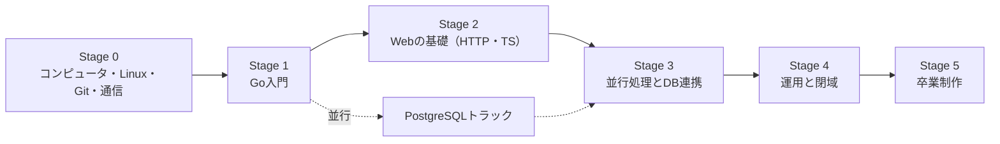

# 学習ロードマップ

6つのステージを順に進む。各ステージはユニット（1ユニット＝AIなしデー半日〜2回分）で構成し、PostgreSQLのユニットだけはStage 1から並行して進める。

点線のPostgreSQLトラックは、Stage 1〜2のAIなしデーで毎回1時間ずつ進め、Stage 3でGoと合流する。

| ステージ | 目安（AIなしデー） | ユニット | 主な内容 | 成果物 | 詳細 |
| --- | --- | --- | --- | --- | --- |
| Stage 0：基礎 | 8〜12回 | F1〜F10 | 2進数と文字コード、シェル、プロセス、Git、TCP/IP、HTTP、Docker入門 | シェルスクリプト数本、GitHubへのpush | [03](03-foundation.md) |
| Stage 1：Go入門 | 10〜15回 | G1〜G11、D1〜D5 | 文法、エラー処理、テスト、データ構造とアルゴリズム、SQLの基本 | CLIツール3本（テスト付き） | [04](04-go-track.md)、[06](06-postgresql-track.md) |
| Stage 2：Webの基礎 | 12〜18回 | T1〜T10、G12〜G14、D6〜D12 | HTML/JS/TS、React、GoのHTTP API、テーブル設計 | REST API＋管理画面 | [04](04-go-track.md)、[05](05-typescript-track.md)、[06](06-postgresql-track.md) |
| Stage 3：並行処理とDB連携 | 8〜12回 | G15〜G18、D13〜D15 | goroutine、context、pgx、マイグレーション、実行計画、時系列データ | DBを使うAPI | [04](04-go-track.md)、[06](06-postgresql-track.md) |
| Stage 4：運用と閉域 | 8〜12回 | O1〜O8 | systemd、調査ツール、Docker、IaC、オフライン開発 | オフラインで再構築できる開発環境 | [07](07-ops-offline-track.md) |
| Stage 5：卒業制作 | 12〜20回 | C1〜C8 | 監視ダッシュボードの設計・実装・運用 | 閉域で動く統合システム一式 | [08](08-capstone-watchdeck.md) |

## 1回のAIなしデーの配分（目安）

[1日のテンプレート](02-ai-free-day.md)（6時間）の時間割を、ステージ別に並べたもの。時間割を変えるときは、テンプレート側を正とする。

| ステージ | メイン（そのステージのユニット） | PostgreSQL | コードリーディング | デバッグ | ウォームアップ・メモ・振り返り |
| --- | --- | --- | --- | --- | --- |
| Stage 0 | 2時間 | ― | 1.5時間 | 1時間 | 1.5時間 |
| Stage 1〜2 | 1時間 | 1時間 | 1.5時間 | 1時間 | 1.5時間 |
| Stage 3〜5 | 2時間（DBを含む） | ― | 1.5時間 | 1時間 | 1.5時間 |

Stage 2では、Goのユニットを先に進める。G12はT4の前に、G13〜G14はT10の前に済ませておく（T4とT10が、そのAPIを呼ぶため）。

つまずいたユニットは、次に進まず同じユニットを繰り返してかまわない。完了条件を満たすことを、回数より優先する。
