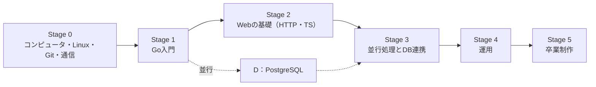

6つのステージを、順に進む。各ステージは、ユニット（1ユニット＝メイン枠で1〜3回分）でできている。ユニットは、分野ごとの6つのトラック（F・G・T・D・O・C）に分かれていて、IDの頭文字がトラックを表す。

点線のPostgreSQLのトラックは、Stage 1〜3のAIなしデーで毎回1時間ずつ進める。Stage 3で、扱う内容がGoのトラックと合流する（GoからDBにつなぐ）。

## ステージ

### Stage 0：基礎

- 目安：AIなしデー 14〜20回（ユニット13〜19回＋実技1回）
- ユニット：[F1〜F10](10-track-f-foundation.md)
- 内容：2進数と文字コード、シェル、プロセス、シェルスクリプト、Git、SSH、TCP/IP、HTTP、Docker入門
- 成果物：シェルスクリプト数本、自分の手で積んだコミットと、GitHubへのpush

### Stage 1：Go入門

- 目安：AIなしデー 25回（ユニット24回＋実技1回）
- ユニット：[G1〜G11](11-track-g-go.md)、[D1〜D5](13-track-d-postgresql.md)
- 内容：文法、エラー処理、テスト、データ構造とアルゴリズム、SQLの基本
- 成果物：テスト付きのCLIツール3本（`wc` のクローン、`csvstat`、`logagg`）

### Stage 2：Webの基礎

- 目安：AIなしデー 30〜32回（ユニット29〜31回＋実技1回）
- ユニット：[G12〜G14](11-track-g-go.md)、[T1〜T10](12-track-t-web.md)、[D6〜D12](13-track-d-postgresql.md)
- 内容：GoのHTTP API、HTML・JavaScript・TypeScript、React、テーブル設計
- 成果物：REST APIと、それにつながる管理画面
- 進める順番：GをTより先に進める。G12はT4の前に、G13〜G14はT10の前に済ませる（T4とT10が、そのAPIを呼ぶため）

### Stage 3：並行処理とDB連携

- 目安：AIなしデー 18回（ユニット17回＋実技1回）
- ユニット：[G15〜G20](11-track-g-go.md)、[T11](12-track-t-web.md)、[D13〜D15](13-track-d-postgresql.md)
- 内容：goroutine、context、pgx、HTTPクライアントとリトライ、SSE、マイグレーション、実行計画、時系列データ
- 成果物：データベースを使い、リアルタイムに配信するAPI

### Stage 4：運用

- 目安：AIなしデー 20〜25回（ユニット19〜24回＋実技1回）
- ユニット：[O1〜O9](14-track-o-ops.md)
- 内容：Linuxの管理、systemd、調査ツール、Docker、構成管理、再現できるビルド、他人のコードの引き継ぎ、負荷試験
- 成果物：リポジトリだけから作り直せるビルドと、引き継いで直したサービス

### Stage 5：卒業制作

- 目安：AIなしデー 29〜35回（必須版。卒業制作そのものが実技にあたるので、別の実技はない）
- ユニット：[C1〜C8](15-track-c-capstone.md)
- 内容：監視ダッシュボード watchdeck の設計・実装・運用
- 成果物：動かし続けられる、統合されたシステム一式（障害試験の結果つき）

## 目安の回数について

全体で約136〜155回（セッション）。上の各ステージの合計で、真の初学者を想定した概算。ステージ通過の実技を含む（4回ごとの見直しは、振り返りの枠の中で行うので、回数には足さない）。かかる期間は、ペースで決まる。

- 週1回：約2年半〜3年
- 週2回：約1年3か月〜1年6か月
- 週3回：約11か月〜1年

この回数は、各ユニットの課題シートに書いてある「目安」を足したもの。シートの目安を変えたら、ここも直す。

ペースの選び方は[AIなしデーの進め方](04-ai-free-day.md)にある。Stage 0は、最初の6回が短縮版（段階的な導入）であることも見込んでいる。

既に知っているユニットは[テストアウト](01-overview.md)で飛ばせるので、実際はこれより短くなることが多い。目安と実績がずれていたら、自分の計画のほうを直す。つまずいたユニットは、次に進まず、同じユニットを繰り返してかまわない。完了条件を満たすことを、回数より優先する。

## 1回のAIなしデーの時間の配分

[AIなしデーの進め方](04-ai-free-day.md)の時間割（6時間）を、ステージ別に並べたもの。時間割を変えるときは、そちらを正とする。

- Stage 0：メイン 3.5時間 ／ コードリーディングかデバッグ 1.5時間 ／ ウォームアップと振り返り 1時間
- Stage 1〜3：メイン（Go・TS）2.5時間 ／ PostgreSQL 1時間 ／ コードリーディングかデバッグ 1.5時間 ／ ウォームアップと振り返り 1時間
- Stage 4〜5：メイン 3.5時間 ／ コードリーディングかデバッグ 1.5時間 ／ ウォームアップと振り返り 1時間

コードリーディングとデバッグは、1回おきに交代する。
