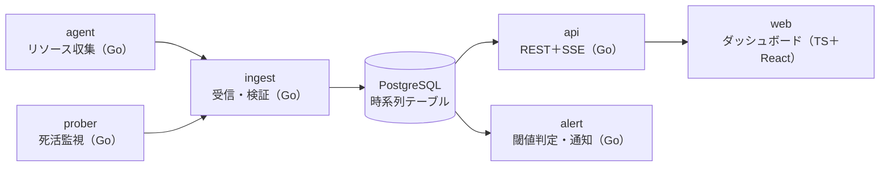

# 卒業制作：監視ダッシュボード「watchdeck」

Stage 5では、手元や案件のサーバーの死活状態とリソース使用量を集め、リアルタイムにグラフ表示してアラートを出す、閉域でも動く監視システムを作る。データは自分のサーバーから取れるので、題材集めの制約がなく、完成後も実際に使える。実装は `capstone/` 配下に置く。

## 構成



agentが各サーバーのCPU・メモリ・ディスクを集めて送り、proberがHTTPやTCPで死活を確認する。ingestが検証して保存し、apiがwebへ配信し、alertが閾値を超えたら通知する。

## ディレクトリ案

```text
capstone/
├── cmd/            # agent, prober, ingest, api, alert の main
├── internal/       # 共通パッケージ
├── migrations/     # 番号付きSQL
├── web/            # TypeScript + React
├── deploy/         # Dockerfile, compose, systemd ユニット, IaC
└── docs/           # 要件定義書, ADR, runbook, 試験結果
```

## 機能要件

1. 登録したサーバーの死活とCPU・メモリ・ディスク使用率を一覧表示し、5秒以内に更新される
2. サーバーごとに過去24時間のグラフを表示し、期間を切り替えられる
3. 閾値ルールでアラートを出し、発生と復旧を記録して、Webhookで通知する
4. グループやタグでサーバーを絞り込める
5. 古いデータを1分平均などに集約し、保持期間を過ぎたら削除する

## 非機能要件

- ネットワーク遮断下で、ビルドから起動まで完結する
- 100台・10秒間隔の送信で、APIのp95レイテンシ100ms以下
- `docker compose up`一発で中央側が起動し、agentは単体のバイナリとsystemdで動く
- 認証付き、設定変更には監査ログを残す
- 中央側が止まっても、agentがデータを一時保存し、復旧後に再送する
- watchdeck自身の状態（受信件数、遅延、エラー数）も監視できる

## 進め方（C1〜C8）

| ステップ | 作業 | 使う主なユニット |
| --- | --- | --- |
| C1 | 要件定義書とADR（技術選定の記録）を書く。時系列データのテーブルを設計する | D6、D7、D15 |
| C2 | agentを実装する。`/proc`からCPU・メモリ・ディスクを読み、送信する。テストを付ける | G5〜G8 |
| C3 | proberを実装する。多数の対象を並行して死活監視する | G15、G16 |
| C4 | ingestと保存処理を実装する。集約、保持期間、インデックスを設計する | D13〜D15 |
| C5 | apiを実装する。REST、SSE配信、認証、監査ログ | G12〜G17 |
| C6 | webを実装する。一覧、グラフ、リアルタイム更新、絞り込み | T6〜T10、Stage 5の応用 |
| C7 | alertを実装する。負荷試験、pprofでのチューニング、障害試験（DB停止、agentの再送） | O3〜O5 |
| C8 | agentのsystemd化、閉域での完全再構築テスト、運用手順書（runbook）、振り返り | O2、O6〜O8 |

## 成果物

- ソースコード一式（テスト、Dockerfile、compose、systemdユニット、IaC）
- 要件定義書、ADR、運用手順書
- 負荷試験と障害試験の結果レポート
- 「AIなしで書いた部分」と「AIを使った部分」の区分けと、その判断理由

完成後は、自分のサーバーや案件の監視に実際に使い、運用しながら改善していける。
