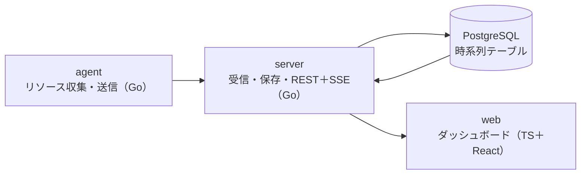

# 卒業制作：監視ダッシュボード「watchdeck」

Stage 5では、自分のサーバーの死活状態とリソース使用量を集め、リアルタイムにグラフ表示する、閉域でも動く監視システムを作る。データは自分のサーバーから取れるので、題材集めの制約がなく、完成後も実際に使える。実装は `capstone/` 配下に置く。

まず「必須版」を完成させ、動くものを手に入れてから「発展」を足す。必須版だけで卒業できる。

このリポジトリは公開しているので、実在のホスト名・IPアドレス・認証情報は、コードにも設定例にもテストデータにも書かない。接続先は `.env`（Gitの管理外）で渡す。

## 構成（必須版）



agentが各サーバーのCPU・メモリ・ディスクを10秒ごとに集めて送る。serverが検証して保存し、webへ配信する。死活は「最後に受信してから30秒以上たったか」で判定する。

発展では、serverを役割ごとに分ける（ingest＝受信、api＝配信）。さらに、外からHTTPやTCPで死活を確認するproberと、閾値を超えたら通知するalertを足す。

## ディレクトリ案

```text
capstone/
├── cmd/            # agent, server の main（発展で prober, alert など）
├── internal/       # 共通パッケージ
├── migrations/     # 番号付きSQL
├── web/            # TypeScript + React
├── deploy/         # Dockerfile, compose, systemd ユニット（発展で Ansible）
└── docs/           # 要件定義書, ADR, runbook, 試験結果
```

## 機能要件

必須：

1. 登録したサーバーの死活とCPU・メモリ・ディスク使用率を一覧表示し、5秒以内に更新される
2. サーバーごとに過去24時間のグラフを表示し、期間を切り替えられる
3. 保持期間を過ぎた古いデータを、自動で削除する

発展（任意。卒業には2つ以上）：

- 閾値ルールでアラートを出し、発生と復旧を記録して、Webhookで通知する（alert）
- HTTPやTCPで外から死活を確認する（prober）
- グループやタグでサーバーを絞り込める
- 古いデータを1分平均などに集約する。テーブルを時刻で分割する（パーティション）
- 設定変更に監査ログ（誰がいつ何を変えたかの記録）を残す
- 中央側が止まっても、agentがデータを一時保存し、復旧後に再送する
- watchdeck自身の状態（受信件数、遅延、エラー数）も監視できる
- Ansibleで、空のサーバーに一式を構築できる

## 非機能要件

必須：

- ネットワーク遮断下で、ビルドから起動まで完結する
- `docker compose up`一発で中央側が起動し、agentは単体のバイナリとsystemdで動く
- APIはトークンで認証する
- 送信に失敗したagentは、間隔を空けて再試行し、中央側の復旧後に自動で送信を再開する（止まっていた間のデータは失ってよい）
- 10台・10秒間隔の送信で、一覧とグラフが問題なく動く

発展：

- 100台・10秒間隔の送信で、APIのp95レイテンシ100ms以下（負荷試験の結果で示す）

## 進め方（C1〜C8）

C1〜C7が必須版、C8が発展。

| ステップ | 作業 | 使う主なユニット |
| --- | --- | --- |
| C1 | 要件定義書とADR（技術選定の記録）を書く。時系列データのテーブルを設計する | D6、D7、D15 |
| C2 | agentを実装する。`/proc`からCPU・メモリ・ディスクを読み、リトライ付きで送信する。テストを付ける | G5〜G8、G19、O1 |
| C3 | serverの受信と保存を実装する。入力の検証、マイグレーション、インデックス、古いデータの削除 | G12〜G14、G17、D13〜D15 |
| C4 | serverの配信を実装する。REST、SSE、トークン認証 | G14、G16、G20 |
| C5 | webを実装する。一覧、グラフ、リアルタイム更新 | T6〜T11、[Stage 5で使う応用](05-typescript-track.md) |
| C6 | 配布の形にする。Dockerfile、compose、agentのsystemd化 | O2、O4、O5 |
| C7 | 閉域での完全再構築テスト、障害試験（DB停止、server停止からの復帰）、運用手順書（runbook）、振り返り | O7、O8 |
| C8 | 発展から選んで実装する。負荷試験とチューニングは、どれを選んでも行うことを勧める | G15（prober、alert）、O3、O6、O9 |

## Stage 5でのAIの使い方

- AIなしデーに書くのは、agent、server、webの中心部分（データの流れに関わるコード）
- 平日にAIを使ってよいのは、レビュー、見た目の調整（CSS）、ドキュメントの校正。使った箇所は `[ai]` か `[mixed]` でコミットする

## 成果物

- ソースコード一式（テスト、Dockerfile、compose、systemdユニット）
- 要件定義書、ADR、運用手順書
- 障害試験の結果レポート（発展で負荷試験も）
- 「AIなしで書いた部分」と「AIを使った部分」の区分けと、その判断理由

完成後は、自分のサーバーの監視に実際に使い、運用しながら改善していける。
