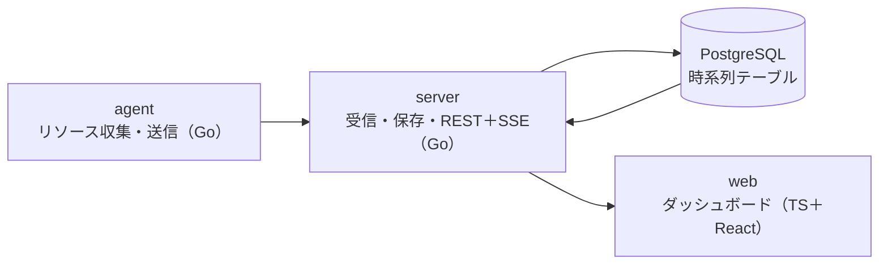

卒業制作のトラック。Stage 5では、監視ダッシュボード「watchdeck」を作る。自分のサーバーの死活状態とリソース使用量を集め、リアルタイムに表示する監視システムを作り、壊しても直せることを試験で示す。データは自分のサーバーから取れるので、題材集めの制約がなく、完成後も実際に使える。実装は `capstone/` 配下に置く。

まず「必須版」を完成させ、動くものを手に入れてから「発展」を足す。必須版だけで卒業できる。

リポジトリは、公開・非公開にかかわらず「公開される前提」で扱うので、実在のホスト名・IPアドレス・認証情報は、コードにも設定例にもテストデータにも書かない。接続先は `.env`（Gitの管理外）で渡す。

## このトラックで身につくこと

- 要件と設計判断を文書にし、あとから理由をたどれるようにできる
- ここまでのトラック（Go、PostgreSQL、Webフロントエンド、運用）を、1つの動くシステムにまとめられる
- runbook だけで、自分以外の人でも再構築できる
- 障害を計画的に起こして、検出・原因の特定・復旧を時間つきで記録し、手順書に残せる

## 構成（必須版）



agentが各サーバーのCPU・メモリ・ディスクを10秒ごとに集めて送る。serverが検証して保存し、webへ配信する。死活は「最後に受信してから30秒以上たったか」で判定する。

発展では、serverを役割ごとに分ける（ingest＝受信、api＝配信）。さらに、外からHTTPやTCPで死活を確認するproberと、閾値を超えたら通知するalertを足す。

## ディレクトリ案

```text
capstone/
├── cmd/            # agent, server の main（発展で prober, alert など）
├── internal/       # 共通パッケージ
├── migrations/     # 番号付きSQL
├── web/            # TypeScript + React
├── deploy/         # Dockerfile, compose, systemd ユニット（発展で Ansible）
└── docs/           # 要件定義書, ADR, runbook, 試験結果
```

## 機能要件

必須：

1. 登録したサーバーの死活とCPU・メモリ・ディスク使用率を一覧表示し、5秒以内に更新される
2. サーバーごとに、直近1時間の使用率の折れ線グラフを表示する
3. 保持期間を過ぎた古いデータを、自動で削除する

発展（任意。卒業の条件には含めない）：

- 過去24時間のグラフと、期間の切り替え（1時間・6時間・24時間）
- 閾値ルールでアラートを出し、発生と復旧を記録して、Webhookで通知する（alert）
- HTTPやTCPで外から死活を確認する（prober）
- グループやタグでサーバーを絞り込める
- 古いデータを1分平均などに集約する。テーブルを時刻で分割する（パーティション）
- 設定変更に監査ログ（誰がいつ何を変えたかの記録）を残す
- 中央側が止まっても、agentがデータを一時保存し、復旧後に再送する
- watchdeck自身の状態（受信件数、遅延、エラー数）も監視できる
- Ansibleで、空のサーバーに一式を構築できる

## 非機能要件

必須：

- `docker compose up`一発で中央側が起動し、agentは単体のバイナリとsystemdで動く
- APIはトークンで認証する。ブラウザの`EventSource`（T11）は認証用のヘッダを付けられないので、SSEの認証をどうするかは、C1で方式を決めてADRに書く
- 送信に失敗したagentは、間隔を空けて再試行し、中央側の復旧後に自動で送信を再開する（止まっていた間のデータは失ってよい）
- 10台・10秒間隔の送信で、一覧とグラフが問題なく動く

発展：

- 100台・10秒間隔の送信で、APIのp95レイテンシ100ms以下（負荷試験の結果で示す）

## ユニット

各ユニットのページが、課題シートになっている。C1〜C7が必須版、C8は任意の発展。

- **[C1 要件定義と設計](../drills/capstone/C01-requirements/TASKS.md)**：要件定義書とADR（技術選定の記録）を書き、時系列データのテーブルを設計する。使うユニット：D6、D7、D15
- **[C2 agent](../drills/capstone/C02-agent/TASKS.md)**：CPU・メモリ・ディスクを集め、リトライ付きで送信する。CPUとメモリは `/proc` から読む。ディスクの使用率は `/proc` にはないので、`df` が内部で使っている仕組み（`statfs`）を、Goの標準ライブラリから呼ぶ方法を調べる。使うユニット：G5〜G8、G19、O1
- **[C3 受信と保存](../drills/capstone/C03-ingest-store/TASKS.md)**：入力の検証、マイグレーション、インデックス、古いデータの削除。使うユニット：G12〜G14、G17、D13〜D15
- **[C4 配信](../drills/capstone/C04-api-sse/TASKS.md)**：REST、SSE、トークン認証（SSEの認証は、C1で決めた方式）。使うユニット：G14、G16、G20
- **[C5 web](../drills/capstone/C05-web/TASKS.md)**：一覧、直近1時間のグラフ、リアルタイム更新。使うユニット：T1（SVG）、T6（値→座標）、T7〜T11
- **[C6 配布の形にする](../drills/capstone/C06-packaging/TASKS.md)**：Dockerfile、compose、agentのsystemd化。使うユニット：O2、O4、O5
- **[C7 障害試験と runbook](../drills/capstone/C07-fault-drill/TASKS.md)**：runbook だけからの再構築（自分以外の人の手で）、計画した障害の試験、10台の試験、試験結果のまとめ。卒業制作の採点にあたる回。使うユニット：O3、O7、O8
- **[C8 発展](../drills/capstone/C08-extensions/TASKS.md)**：任意。発展から選んで実装する。負荷試験とチューニングは、どれを選んでも行うことを勧める。使うユニット：G15、O3、O6、O9

## Stage 5でのAIの使い方

- AIなしデーに書くのは、agent、server、webの中心部分（データの流れに関わるコード）
- 平日にAIを使ってよいのは、レビュー、見た目の調整（CSS）、ドキュメントの校正。使った箇所は `[ai]` か `[mixed]` でコミットする

## 成果物

- ソースコード一式（テスト、Dockerfile、compose、systemdユニット）
- 要件定義書、ADR、運用手順書
- 障害試験の結果レポート（発展で負荷試験も）
- 「AIなしで書いた部分」と「AIを使った部分」の区分けと、その判断理由

完成後は、自分のサーバーの監視に実際に使い、運用しながら改善していける。
